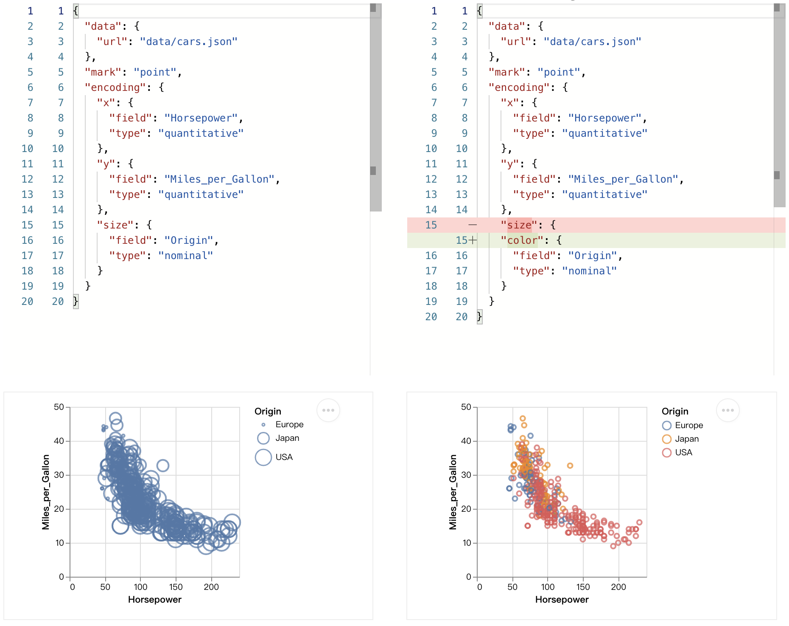
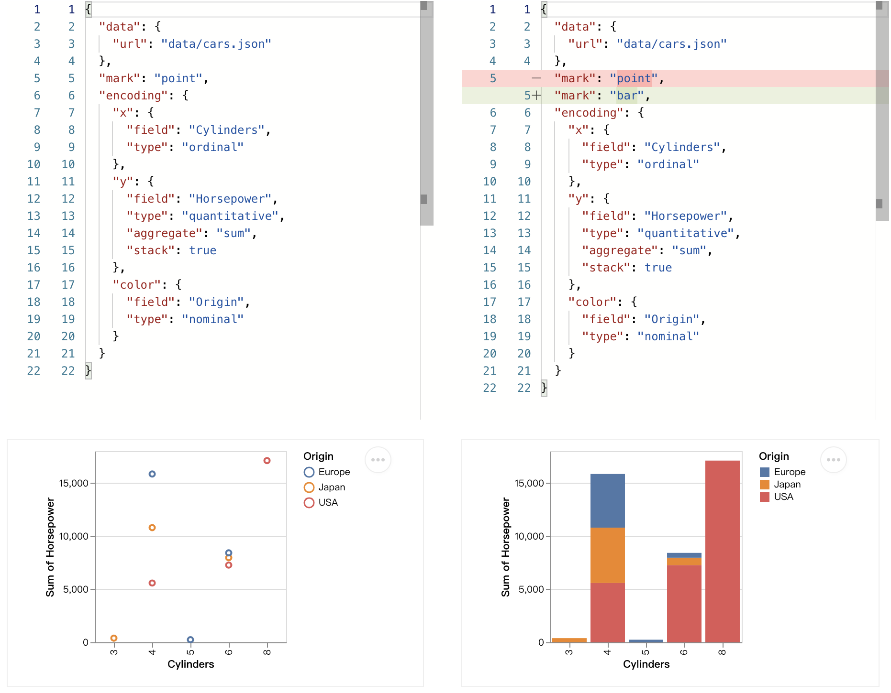
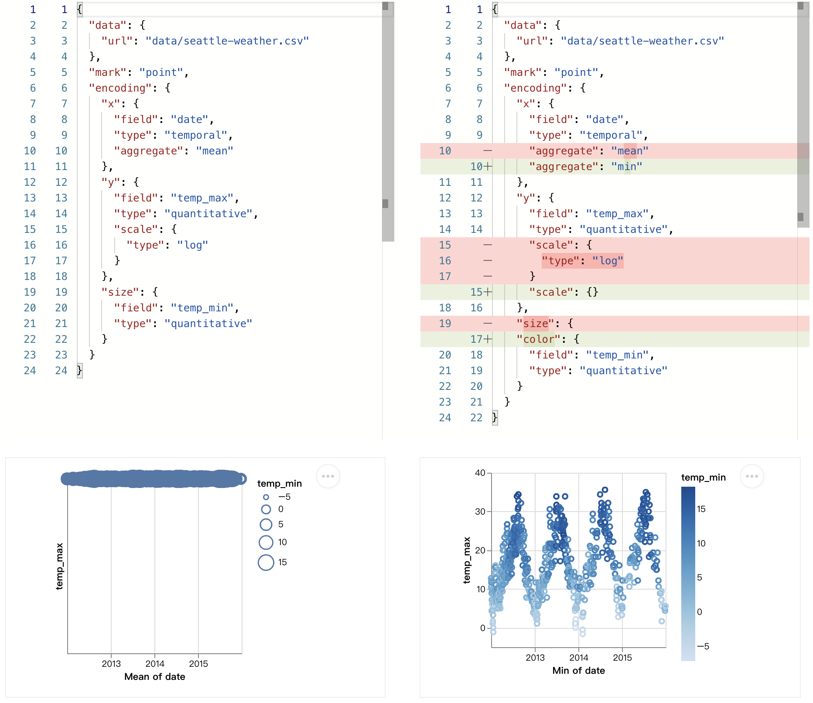
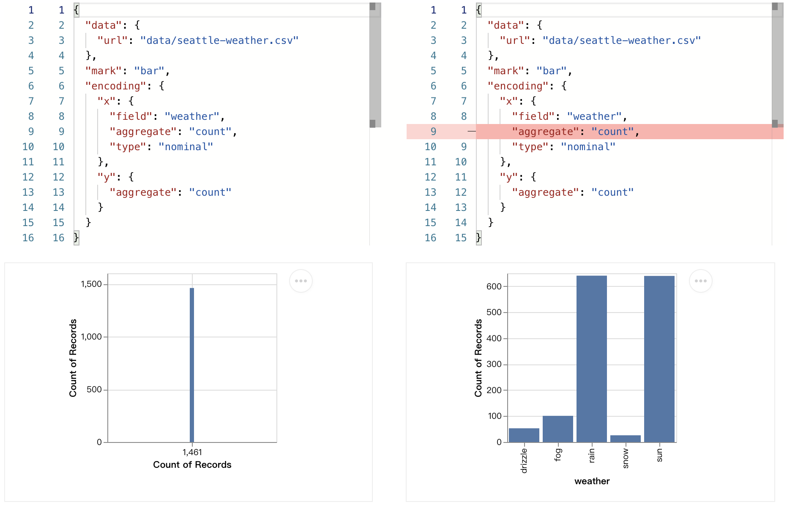

Example
************************
Here are some examples using ``vega-lite-linter`` to detect and fix errors in the visualization.

Example 1
==================
In this case, the original visualization(left) has violated one rule:

- Channel size implies order in the data, it is not suitable for nominal data.

It can be fixed by changing the channel ``size`` to ``color``.

.. raw:: html

   

   

.. code-block:: python

    from vega_lite_linter import Lint

    vega_json = {
        "data": {
            "url": "data/cars.json"
        },
        "mark": "point",
        "encoding": {
            "x": {
                "field": "Horsepower",
                "type": "quantitative"
            },
            "y": {
                "field": "Acceleration",
                "type": "quantitative"
            },
            "size": {
                "field": "Origin",
                "type": "nominal"
            }
        }
    }

    # initialize
    lint = Lint(vega_json)

    # show rules that the input vega-lite json violated
    violate_rules = lint.lint()

    # show fixing recommendation by vega-lite-linter
    fix = lint.fix()

    print(fix['optimize_spec'])   

.. raw:: html

   

Example 2
==================
In this case, the original visualization(left) has violated one rule:

- Only use stacking for mark 'bar' and 'area'.

It can be fixed by changing the mark type from ``point`` to ``bar``.

.. raw:: html

   

   

.. code-block:: python

    from vega_lite_linter import Lint

    vega_json = {
        "data": {
            "url": "data/cars.json"
        },
        "mark": "point",
        "encoding": {
            "x": {
                "field": "Cylinders",
                "type": "ordinal"
            },
            "y": {
                "field": "Horsepower",
                "type": "quantitative",
                "aggregate": "sum",
                "stack": True
            },
            "color": {
                "field": "Origin",
                "type": "nominal"
            }
        }
    }

    # initialize
    lint = Lint(vega_json)

    # show rules that the input vega-lite json violated
    violate_rules = lint.lint()

    # show fixing recommendation by vega-lite-linter
    fix = lint.fix()

    print(fix['optimize_spec'])

.. raw:: html

   

Example 3
==================
In this case, the original visualization(left) has violated three rules:

- Channel size is not suitable for data with negative values.
- Only use log scale on data that are all positive.
- Temporal data only supports min and max aggregation.

It can be fixed by actions:

- Removing log scale in the channel ``y``.
- Using ``min`` aggregation for the data in the channel ``x`` instead.
- Changing channel ``size`` to ``color``.

.. raw:: html

   

   

.. code-block:: python

    from vega_lite_linter import Lint

    vega_json = {
        "data": {
            "url": "data/seattle-weather.csv"
        },
        "mark": "point",
        "encoding": {
            "x": {
                "field": "date",
                "type": "temporal",
                "aggregate": "mean"
            },
            "y": {
                "field": "temp_max",
                "type": "quantitative",
                "scale": {
                    "type": "log"
                }
            },
            "size": {
                "field": "temp_min",
                "type": "quantitative"
            }
        }
    }

    # initialize
    lint = Lint(vega_json)

    # show rules that the input vega-lite json violated
    violate_rules = lint.lint()

    # show fixing recommendation by vega-lite-linter
    fix = lint.fix()

    print(fix['optimize_spec'])

.. raw:: html

   

Example 4
==================
In this case, the original visualization(left) has violated visual guidelines:

- Use count aggregation once in the visualization.
- Use count aggregation or declare a data field of an encoding, instead of doing both of them.
- Nominal data cannot be aggregated.

It can be fixed by removing aggregation in the channel ``x``.

.. raw:: html

   

   

.. code-block:: python

    from vega_lite_linter import Lint

    vega_json = {
        "data": {
            "url": "data/seattle-weather.csv"
        },
        "mark": "bar",
        "encoding": {
            "x": {
                "field": "weather",
                "type": "nominal",
                "aggregate": "count"
            },
            "y": {
                "type": "quantitative",
                "aggregate": "count"
            }
        }
    }

    # initialize
    lint = Lint(vega_json)

    # show rules that the input vega-lite json violated
    violate_rules = lint.lint()

    # show fixing recommendation by vega-lite-linter
    fix = lint.fix()

    print(fix['optimize_spec'])

.. raw:: html

   
