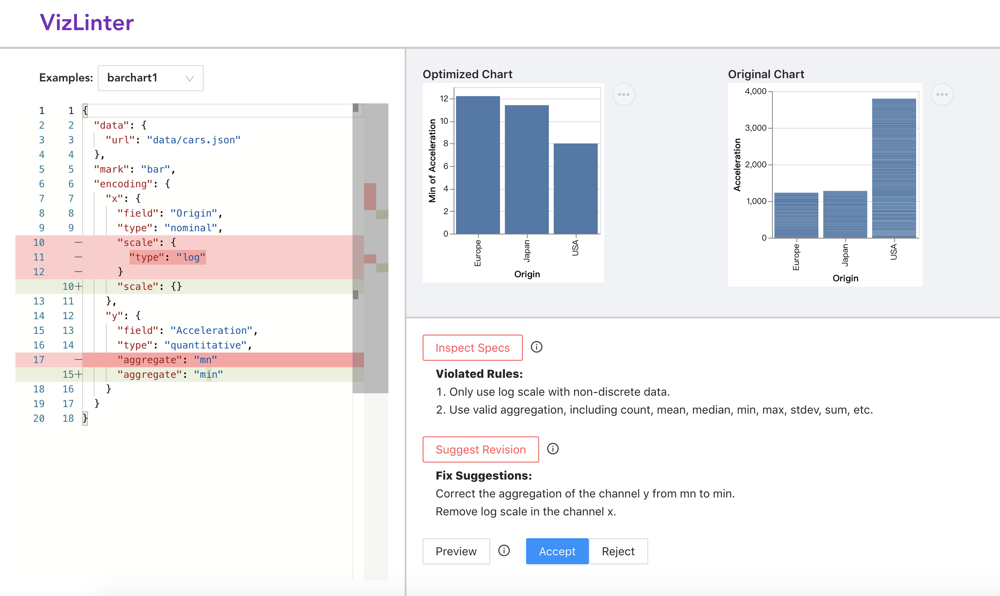

.. vega-lite-linter documentation master file, created by
   sphinx-quickstart on Sun Apr 25 15:01:37 2021.
   You can adapt this file completely to your liking, but it should at least
   contain the root `toctree` directive.

``vega-lite-linter``
************************

..
  ``vega-lite-linter`` is a Python Package helping find and fix issues in your visualization design written in Vega-Lite based on the Answer Set Programming.

What is ``vega-lite-linter``?
============================================

Despite the growing popularity of data visualization and relavent systems, users may create imperfect visualizations with chart construction errors, 
for example, applying wrong type of data field with the encoding channel. 

``vega-lite-linter`` is a package to help users detect flaws and rectify already-built but defective visualizations. 
The package consists of two components:

#. A visualization linter, which applies well-recognized principles to inspect the legitimacy of rendered visualizations
#. A visualization fixer, which automatically corrects the detected violations according to the linter.

Users only need to feed visualization specification written in Vega-Lite into ``vega-lite-linter``, issues and suggested revision of the visualization will be provided.

Try Online
============================================

An online Vega-Lite editor `VizLinter <http://vizlinter.idvxlab.com/>`_ is created with linting and fixing functions based on ``vega-lite-linter`` for any Vega-Lite developer to build and validate visualizations.

.. toctree::
   :maxdepth: 2
   :hidden:

   setup
   api
   rule
   example

..
 Indices and tables
 ==================
 * :ref:`genindex`
 * :ref:`modindex`
 * :ref:`search`
